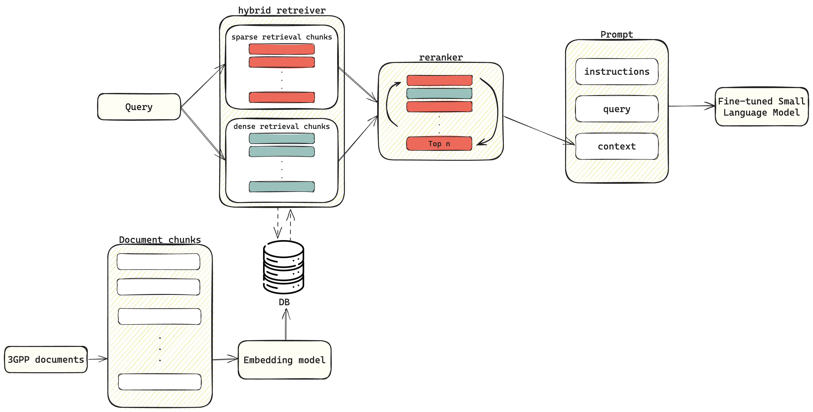

# oKUmura_AI_Telecom_challenge
## Folder set up
<!--├── .lightning_studio -->
```
.
├── data
│ ├── questions_new.txt
│ ├── TeleQnA.json
│ └── TeleQnA.txt
├── models
├── results
│ ├── context_all_train.pkl
│ └── context_all_train.csv
├── .viminfo
├── README.md
├── fine_tuning.py
├── main_temp.py
├── requirements.txt
├── utils.py
└── vector_store_for_rag.py
```


<!-- ├── context_save.py
├── data_process.ipynb -->

## How to run code
1. Clone this repo
   ```
   git clone https://github.com/Nouf-Alabbasi/oKUmura_AI_Telecom_challenge.git
   cd oKUmura_AI_Telecom_challenge
   ```
2. Install packages from requirements 
   ```
   pip install -r requirements.txt
   ```
3. Download data
   - Download competition data and copy it to ``data/`` directory inside your cloned repository
   - Extract rel18 folder from rel18.rar
4. clone the longLM repo from https://github.com/datamllab/LongLM into the cloned repository 
   ```
   git clone https://github.com/datamllab/LongLM.git
   ```
5. Run ``vectore_store_for_rag.py`` to obtain and store the vectorized documents
<!-- added flash_attn to requirements.txt -->
6. Run ``fine_tuning.py`` to finetune the model on the teleQnA training with retrieved-context
7. Run ``main.py`` to run inference on the test set, but make the following changes first
   - set 'model_path' to the path of your finetuned phi-2 model
   - when running main.py for the first time, set create_BM26_nodes to True
   
## Explanations of features used
<!-- add node that mentions the base code's source -->
<!-- architecture -->

- ### rerank
   * After retrieving a large list of context chunks, the chunks are ranked based on the relevancy score from a cross-encoder. A shortlist is derived the reranke list of context chunks. We used ms-marco-MiniLM-L-6-v2, this model demonstrates relatively high speed and decent accuracy.

- ### self extend
   * Self-extend is a technique that uses two-level attention to allow the LLMs to handle longer input, alleviating the need for finetuning. Given the long input given to the LLM, self-extend has been a promising tool that improved performance and also opened up the door for techniques like semantic chunking, where the chunks are naturally long, to be effectively used. 

- ### hybrid retriever
   * We used a hybrid retriever combining BM25 and a dense vector retriever to leverage the strengths of both methods: BM25 for precise keyword-based matching and the dense vector retriever for capturing semantic similarities, ensuring comprehensive and accurate retrieval of relevant information.

- ### embedding model
   * BAAI/bge-small-en-v1.5 is a lightweight and efficient model designed for high-speed text embedding, chosen for its ability to generate dense vector representations of text that enhance the performance of our retrieval and ranking tasks in the fine-tuned model.

- ### Fine-tuned Small language model
   * **small language model**: Phi-2
      - Phi-2 is a Transformer with 2.7 billion parameters developed by Microsoft, designed for natural language understanding and generation tasks.
      - limitations:
         - **Unreliable Responses to Instruction**: The model lacks instruction fine-tuning, making it less effective at following complex or detailed user instructions.
         - **Language Limitations**: Primarily designed for standard English, the model may struggle with informal language, slang, or other languages, leading to misunderstandings or errors.
   * **Instruction/supervised Finetuning**:
      - LoRA (Low-Rank Adaptation) was used because it significantly reduced computational and memory requirements while maintaining or improving model performance by adding a small number of trainable parameters, making the process efficient and cost-effective.
      - The model was finetuned on a question-answer set. The question was presented within the same prompt used in the inference stage, which included instructions, the question, and the context. The question set included telecom questions to mitigate the model's language limitation.

## Hardware needed (e.g. Google Colab or the specifications of your local machine)
- hardware: 1 L4 GPU
- environment: 
   - python version: 3.10.10
   - Required Python packages (listed in `requirements.txt`)


## Expected run time for each notebook. 
<!-- This will be useful to the review team for time and resource allocation. -->
* expected time to create vector store 
   * ~ 4 hrs for chunking and vector db
   * ~ 5 hrs for the context retrieval
* expected time for fine-tuning
   * ~ 2 hrs
* expected time for inference
   * ~40 minutes for set 1
   * 2 hrs for full test set
   * + the time it takes to create nodes


## Data
* ### TeleQnA_training.txt
   * 1 MB
   * This file contains the training data. It contains around 1000 questions, these fields are available for each question:
      - **Question:** This field consists of a string that presents the question associated with a specific concept within the telecommunications domain.
      - **Options:** This field comprises a set of strings representing the various answer options.
      - **Answer:** This field contains a string that adheres to the format ’option ID: Answer’ and presents the correct response to the question. A single option is correct; however, options may include choices like “All of the Above” or “Both options 1 and 2”.
      - **Explanation:** This field encompasses a string that clarifies the reasoning behind the correct answer.
      - **Category:** This field includes a label identifying the source category (e.g., lexicon, research overview, etc.).
   * this is an example of a question from the training dataset
      ```
      "question 4": {
         "question": "How does a supporting UE attach to the same core network operator from which it detached in a shared network? [3GPP Release 17]",
         "option 1": "It requests the core network node to remember its previous selection.",
         "option 2": "It uses information stored in the UE when it was detached.",
         "option 3": "It relies on the SIM/USIM card for information.",
         "option 4": "It performs a fresh attach procedure.",
         "answer": "option 2: It uses information stored in the UE when it was detached.",
         "explanation": "A supporting UE in a shared network attaches to the same core network operator it detached from by using information stored in the UE when it was detached.",
         "category": "Standards specifications"
      },
      ```

* ### Q_A_ID_training.csv
   * 19.8 KB
   * This file contains the target for the training.txt file.

* ### TeleQnA_testing1.txt
   * 177.5 KB
   * This is the file you will apply your model to. This file contains 366 questions. The format is similar to the questions in the training dataset, the only difference is that the answer and explanation fields are not included for each question.

* ### questions_new.txt
   * 867.7 KB
   * additional testing data. This file contains 2000 extra test questions.

* ### rel18.rar
   * 824.4 MB
   * This is the corpus of technical documents.

<!-- we might need to add the teleQnA.json file here too -->
